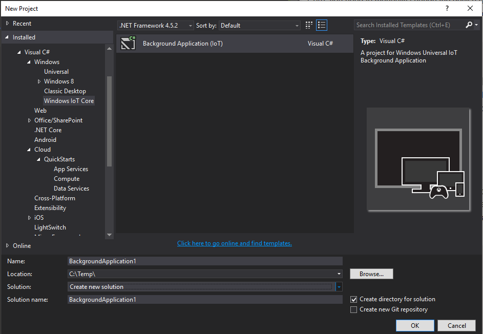

# BrickPi.Uwp

[Windows 10 IoT Core](https://developer.microsoft.com/en-us/windows/iot) [Universal Windows Platform (UWP)](https://msdn.microsoft.com/en-us/windows/uwp/get-started/universal-application-platform-guide) on [Raspberry Pi](https://www.raspberrypi.org/products/raspberry-pi-2-model-b/) implementation for [Dexter BrickPi](http://www.dexterindustries.com/BrickPi/) board enabling [LEGO MINDSTORMS](http://www.lego.com/mindstorms/) 

#### Current Status

The code has been tested on **Raspberry Pi 2 Model B** and Windows IoT Core OS **Version 10.0.14376.0**. So far, Lego Mindstorms NXT 2.0 Sensors and Motors are implemented and tested.

- Mindstorms NXT Touch Sensor
- Mindstorms NXT Color Sensor (see also "Known Issues" section below)
- Mindstorms NXT Ultrasonic Sensor
- Mindstorms EV3 Touch Sensor (untested)

#### Next steps

Next steps include further sensors implementation, such as [Hitechnic Mindstorms Sensors](https://www.hitechnic.com/sensors) and additional Mindstorms EV3 sensors. Also planning to add some more functionality for motors, such as synchronization and PID control.

## Getting Started

#### Raspberry Pi setup

BrickPi requires a fixed non-standard Baud rate of 500.000 baud. As high speed onboard serial is not supported in early versions of Windows 10 IoT Core, you need to manually change the device registry and enable the highspeed serial. 
On the Raspberry Pi, open a console window and use the following command to enable highspeed serial. 

```CMD
Reg add hklm\system\controlset001\services\serpl011\parameters /v MaxBaudRateNoDmaBPS /t REG_DWORD /d 921600
Devcon restart acpi\bcm2837
```

Note: This only has to be done once, and should survive subsequent Windows Updates. If you reimage Windows on your Raspberry Pi to start from scratch, you may need to reapply above patch.

#### Setup of the project

The application will use the Background Application template for Windows IoT Core. 

 

Once the project is created, you need to configure support for serial port capability. This can't be achieved through the UI editor, so you need to text edit the Package.appmanifest file and add (there will be an internetClient capability by default):

```XML
  <Capabilities>
	<Capability Name="internetClient" />
	<DeviceCapability Name="serialcommunication">
	  <Device Id="any">
		<Function Type="name:serialPort" />
	  </Device>
	</DeviceCapability>
  </Capabilities>
```

Add a reference to the BrickPi.Uwp library to your project (Nuget package TODO). First you need to implement a 
deferal for the background task instance

```C#
public sealed class StartupTask : IBackgroundTask
{
	BackgroundTaskDeferral deferal;

	public async void Run(IBackgroundTaskInstance taskInstance)
	{
		deferal = taskInstance.GetDeferral();
		//....
	}
}
```
More details about this can be found in the 
[Developing Background Applications](https://developer.microsoft.com/en-us/windows/iot/win10/backgroundapplications) guide.


### BrickPi

Next you need to get a reference to the BrickPi instance. The BrickPi is connected to an UART port on the Raspberry, which could be specified by name like "UART0", but as the current Raspberry Pi only have one UART available, this could be dropped and the first available UART is used


```C#
//Need a brick and a serial port
Brick brick = await Brick.InitializeInstance("Uart0");
```

To check basic comnunication with the BrickPi works, and see if a correct firmware version is installed on the BrickPi itself, call the `GetBrickVersion()` like this:
```C#
int version = await brick.GetBrickVersion();
Debug.WriteLine(string.Format("Brick Version: {0}", version));
```

The BrickPi should always return version **2**. You should always call `GetBrickVersion()` before you configure any sensors, as this resets any sensor information. This is due to the fact how the firmware version is queried internally by setting all sensors to a specific (non-existing) sensor type.

Internally, the BrickPi runs two Arduinos on the board. Each Arduino has a tiny blue LED connected, which could be controlled through corresponding GPIO-pins from the RaspBerry Pi. Arduino1 Led is controlled through GPIO port 18, corresponding to pin 12 on the RaspBerry Pi 40-pin header, and Arduino2 Led is controlled through GPIO port 27, corresponding to pin 13 on the RaspBerry Pi 40-pin header. Further details on GPIO pin mappings can be found at the [Raspberry Pi 2 & 3 Pin Mappings](https://developer.microsoft.com/en-us/windows/iot/win10/samples/pinmappingsrpi2) overview.

To use the LED in code, you can either set the status (ON or OFF) explicitely, or just toggle from current status

```C#
brick.Arduino1Led.Toggle();	//change status from ON to OFF or vice versa
brick.Arduino2Led.Light= true;	//explicitely set status to ON
```

### Motors

Motors ([Standard NXT Motors](http://shop.lego.com/en-US/Interactive-Servo-Motor-9842)) do not need specific configuration, therefore instances are preinitialized and can be referred through the BrickPi.Motors collection:

```C#
Motor motorA = brick.Motors[MotorPort.Port_MA];
Motor motorD = brick.Motors[MotorPort.Port_MD];

```

Using the reference, motors can be enabled and a velocity set. Velocity can be positive or negative to indicate the direction to run.

```C#
motorA.Velocity = -50;
motorA.Enabled = true;
//...	
motorA.Enabled = false;	//set the motor to float
//...
motorA.Velocity = 0;	//set the motor to hold at current position

````

#### Motor Encoders

Encoders are part of motors and count motor rotation with 0.5 degree precision (720 ticks per revolution). To set custom encoder count, or reset the encoder, the EncoderOffset property can be used. Setting the EncoderOffset equal to current Encoder count, will reset the Encoder.

```C#
int encoderTicks = motorA.Encoder;
//reset the Encoder
motorA.EncoderOffset = motorA.Encoder;
```

### Sensors

Sensor ports typically need to be initialized with the specific sensor type, as different sensors use different response data format. Else if not initialiezd, each sensor port is preinitialized with a RawSensor (technically sending a 10-bit response value), which some analog sensors are using. Else an instance of a specific sensor type needs to be created, and attached to the Brick.Sensors collection. If multiple sensors will be attached, initialized can be hold until all sensors are created and added to the collection.

```C#
NXTTouchSensor touch = new NXTTouchSensor(SensorPort.Port_S1, SensorType.TOUCH_DEBOUNCE);
await brick.Sensors.Add(touch, true); //true to hold initialization until all sensors are attached

NXTUltraSonicSensor ultrasonic = new NXTUltraSonicSensor(SensorPort.Port_S2, SensorType.ULTRASONIC_CONT);
await brick.Sensors.Add(ultrasonic, true);
//...
if (!await brick.InitializeSensors())		//now explicitely call sensor initialization
	Debug.WriteLine("Something went wrong initializing sensors");
```

Sensor data needs to be polled from the BrickPi. This can be done in a single shot using `brick.UpdateValues()`. Most often an continuous loop will be run to poll sensor data (and motor encoder data) continously, this can be done by calling `brick.Start()`

#### Sensor Data

Sensor's internal data buffer will be updated either through non-reccuring or continuous sensor data polling (see above). In the application, sensor data can than be through the various sensor properties, ie. the UltraSonic sensor has a property for Distance
```C#
Debug.WriteLine(string.Format("NXT Ultrasonic, Distance: {0}, ", ultrasonic.Distance)); //distance in cm
Debug.WriteLine(string.Format("NXT Touch, Is Pressed: {0}, ", ultrasonic.State)); //state if pressed or not
```

Internally, sensor data is held as RawValue, such as 0 or 1 for touch sensor, or different color values for Color Sensor
```C#
Debug.WriteLine(string.Format("NXT Color, Raw: {0}", color.RawValue));
```

#### Sensor Events

Sensors will also raise events if sensor values change

```C#
touch.OnPressed += Touch_OnPressed;
touch.OnReleased += Touch_OnReleased;
touch.OnChanged += Touch_OnChanged;
//...

private void Touch_OnChanged(object sender, SensorEventArgs e)
{
	if ((e as TouchSensorEventArgs).Pressed)
	{
		brick.Arduino2Led.Light= true;
	}
	else
	{
		brick.Arduino2Led.Light = false;
	}
} 

private void Touch_OnPressed(object sender, SensorEventArgs e)
{
	brick.Arduino1Led.Light= true;
}

private void Touch_OnReleased(object sender, SensorEventArgs e)
{
	brick.Arduino1Led.Light= false;
}

```

To avoid raising events on noise data, ie. where measured distance may vary by few cm, a Threshold could be set with some sensors, which means no event will be raised if the change is less than the threshold value.

```C#
	ultrasonic.Threshold = 5;
```

### Nuget Package

Coming, stay tuned!

### Known Issues

There seems to be an issue using the Mindstorms NXT 2.0 Color sensor ([this one](http://shop.lego.com/en-US/Color-Sensor-9694)) as reported multiple times in BrickPi forum [here](http://www.dexterindustries.com/topic/has-anyone-got-the-colour-sensor-to-work/), [here](http://www.dexterindustries.com/topic/brickpi-colour-sensor/) or [here](http://www.dexterindustries.com/topic/problems-with-lego-color-sensor/), where the sensor does not initialize correctly if running in `SensorType.COLOR_FULL` (all colors enabled).
To work around, one has to attach the sensor at the first port of a given Arduino (`SensorPort.Port_S1` or `SensorPort.Port_S3`) and leave the next Port unconnected (`SensorPort.Port_S2` or `SensorPort.Port_S4`), but initialize the same color sensor on both ports

```C#
//adding NXTColorSensor twice, on S3 and S4, to work around BrickPi issue. Order (S3 or S4 first) does not matter.
NXTColorSensor color = new NXTColorSensor(SensorPort.Port_S4, SensorType.COLOR_FULL);
await brick.Sensors.Add(color, true);
color = new NXTColorSensor(SensorPort.Port_S3, SensorType.COLOR_FULL);
await brick.Sensors.Add(color, true);

```
_
